# Trabajo Final DIU
*Trabajo final de la asignatura «Diseño de Interfaces de Usuario».*

Autor: Daniel Haro Contreras

[TOC]

## 🙍‍♂️ Parte 1: Mi experiencia UX

A la hora de usar un ordenador, es habitual percibir que algunos servicios resultan más «difíciles» o menos intuitivos de usar que otros. Aunque ese «percibir» es algo casi siempre subjetivo, hay unos motivos que subyacen para que exista una diferencia entre distintos servicios. En esta asignatura se han aprendido los diversos factores críticos que hacen que nuestra aplicación pueda ser, además de *funcional*, **usable** y **accesible**. Al fin y al cabo, todo se resume en que a la hora de desarrollar la interfaz entre una máquina y las personas, tengamos en cuenta precisamente eso: que estamos **comunicándonos** con una persona, y por tanto tenemos que tener en un primer plano a las personas: su comportamiento, psicología, preferencias, miedos, habilidades, dificultades; en definitiva: su **experiencia**.

### Aportaciones en esta asignatura

En el ámbito de los ejercicios de **teoría**:

- En la actividad de **accesibilidad**, analicé detalladamente el cumplimiento de las pautas WCAG con la herramienta https://wave.webaim.org y descubrí otras herramientas como *Web Disability Simulator*, que permiten realmente **comprender** o ponerse en el lugar de quien tiene algún tipo de dificultad: visual, auditiva... En concreto, simulé una dificultad que aunque no es una discapacidad, nos afecta a todos: la poca visibilidad de la pantalla cuando demasiada luz incide en ella. Es primordial siempre ponerse en el lugar de quien usará nuestra aplicación, y herramientas como *Web Disability Simulator* pueden ayudarnos a ello eficazmente.

- En la actividad de **usabilidad**, de nuevo poniéndome en el lugar de estudiante universitario pude evaluar objetivamente si cada una de las webs de universidades cumplían los objetivos que su público marca, como buscar información del comedor, calendario... Comparando tres webs con objetivos muy parecidos, las diferencias radican en la interfaz de usuario: mientras en una el calendario académico se puede obtener sin salir de la página principal (UJA), otra requiere una navegación entre varias páginas hasta llegar al resultado, a no ser que se use la búsqueda (UMA).

  Es por ello que se hace evidente la necesidad de planificar antes de implementar una interfaz **qué elementos son los principales** y deben estar en la página principal.

- En la actividad de **etnografía**, para salir de lo habitual en lo asignatura, no analicé un caso de uso de un computador, sino de **conducción de un coche**. Analizar situaciones tan cotidianas como esta nos puede dar una idea de los pensamientos y decisiones que pueden tomar las personas al afrontar problemas. Cuando una persona use una app desarrollada por nosotros, seguramente terminará sufriendo algunas dificultades, y tenemos que comprobar de que para cada dificultad haya un elemento de ayuda o hayamos neutralizado esa dificultad para mejorar su experiencia.

En el ámbito de las **prácticas**:

- Como aportación principal, me informé detalladamente de los principios de diseño de interfaces **Material Design** para aplicarlo a nuestra práctica, **[GranadaÁrabe](https://github.com/daniharo/DIU21/)**. Aplicar de forma correcta un *guideline* tan usado como Material y sus patrones nos permitió obtener un diseño final que, aparte de ser agradable estéticamente, es sencillo y funcional. Por ello comprobamos que se cumple con certeza la ley [Aesthetic-Usability Effect](https://lawsofux.com/aesthetic-usability-effect/): un diseño agradable es también percibido por los usuarios como más usable.

- Gracias a las prácticas he aprendido a usar una herramienta que ha demostrado su utilidad para distintos usos: [**Canva**](https://canva.com/). Desde la creación de un logotipo, pasando por una Landing Page, o incluso un boceto de web, usar esta herramienta nos ha aportado agilidad e inspiración a la hora de realizar nuestro diseño. En nuestra práctica la usamos incluso para generar imágenes de un ordenador o un móvil que incluyeran el logotipo que habíamos diseñado.
- Aunque conozco bien lo que es el ***bloqueo del artista*** o falta de inspiración, he descubierto que a la hora de desarrollar una interfaz existen numerosas ayudas en forma de herramientas, muchas de ellas gratuitas. Usando herramientas como [Coolors](https://coolors.co/) para elegir paletas de colores o [Font Flipper](https://fontflipper.com/) para tipografías, se puede obtener suficiente *inspiración* para nuestro diseño, como pudimos comprobar.

### Aportaciones UX en otras asignaturas

- En la asignatura de **Sistemas de Información Basados en Web**, diseñé una web completa en la que consultar y gestionar eventos musicales de Granada:

  |                Página principal                 |          Información de un evento           |           Edición de un evento           |
  | :---------------------------------------------: | :-----------------------------------------: | :--------------------------------------: |
  | 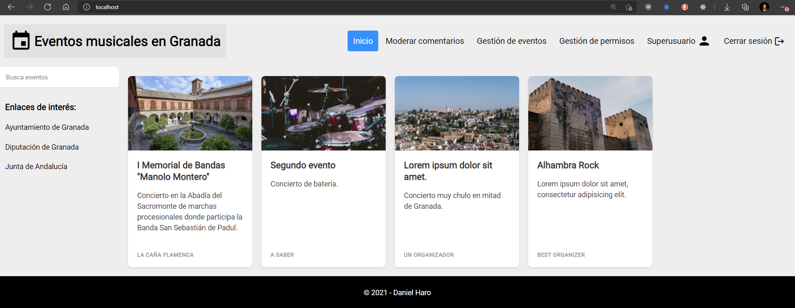 | 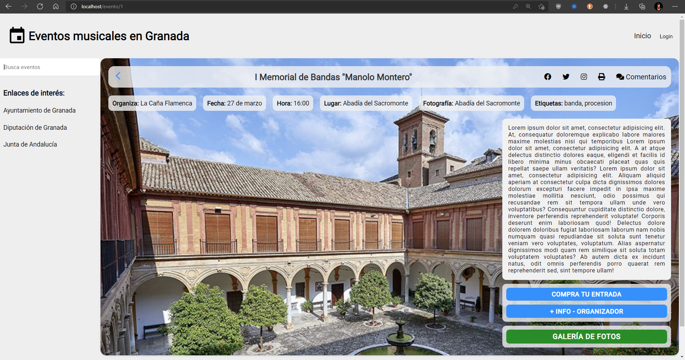 | 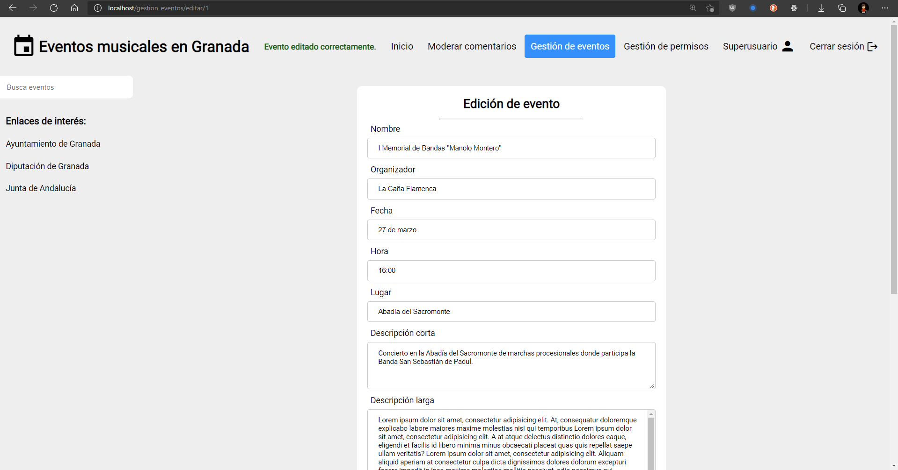 |

  

  

  En este desarrollo apliqué varios de los conocimientos aprendidos en esta asignatura, entre ellos:

  - **Separación** entre los distintos tipos de información.
  - Uso de `max-width` en el formulario para que si el usuario utiliza una **pantalla grande** no tenga que estar constantemente cambiando el foco de su vista de izquierda a derecha. Hay que tener en cuenta **todos los tipos de pantalla**.
  - Uso del pseudoselector CSS `:hover` en todos los enlaces y botones, de manera que cuando el usuario pasa su cursor sobre cualquier botón o enlace la página **reacciona** cambiando el color del fondo de ese elemento. Los diseños deben ser **reactivos** a las acciones de un usuario.

- Por otro lado, en la asignatura **Desarrollo de Software**, desarrollé una aplicación móvil basada también en el guideline Material Design. Su temática es la gestión de la docencia de un profesor:

  |                Modo claro                 |                 Modo oscuro                 |             Ejemplo de uso             |
  | :---------------------------------------: | :-----------------------------------------: | :------------------------------------: |
  | 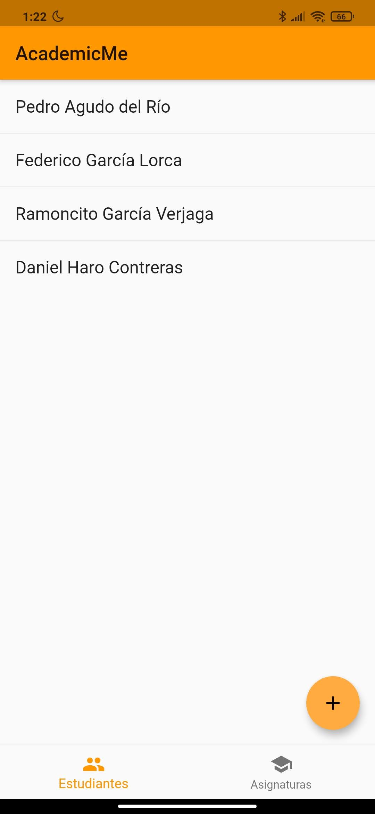 | 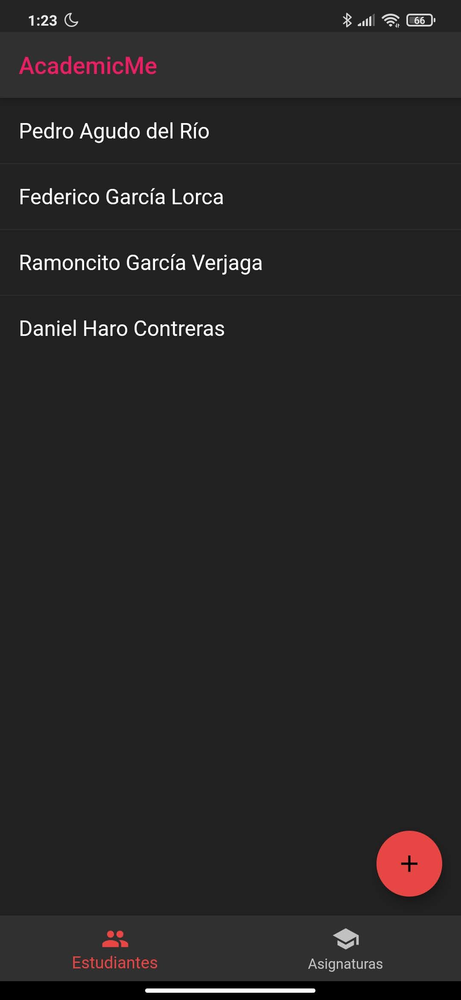 |  |

  Entre los conocimientos de interfaces de usuario aplicados en este proyecto destacan:

  - Se implementó tanto un tema claro como un tema oscuro, para cumplir con las diferentes **preferencias** de los usuarios.

  - Se usaron **patrones** UI como [Bottom Navigation Bar](https://material.io/components/bottom-navigation), [App Bar](https://material.io/components/app-bars-top) o [Floating Action Button](https://material.io/components/buttons-floating-action-button).
  - Añadí validación de todos los campos de los formularios y mensajes de error semánticos: el usuario debe saber **qué** ha introducido erróneamente y **cómo** solucionarlo: **[Ley de Postel](https://lawsofux.com/postels-law/)**
  - A la hora de eliminar un registro, se pide siempre una **confirmación**, y en esa confirmación la acción *Cancelar* está resaltada por defecto, de forma que el usuario no elimine erróneamente registros.
  - Siempre que se modifican o se añaden correctamente registros, se muestra un **mensaje** en forma de [Snackbar](https://material.io/components/snackbars) para **informar** al usuario de que la acción que nos requirió se ha completado. Esto ayuda a que el usuario sepa en todo momento durante su experiencia qué está ocurriendo o ha ocurrido.

------

## 💻 Parte 2: Caso de estudio. Web YUZIN

### Descripción del caso de estudio

Sobre **Yuzin**, y tal y como se puede leer en su [web](https://yuzin.com/quienes-somos/):

> **Yuzin Club Cultural** es una plataforma de divulgación y promoción de contenidos culturales que combina **agenda cultural** con **marketplace** de venta de entradas para espectáculos. Además también somos un **club cultural** al que puedes asociarte para beneficiarte de descuentos y actividades exclusivas.

Antes de empezar el análisis, debemos tener claros los propósitos que persigue esta plataforma. Podemos ver que se resumen en cuatro apartados:

- **Agenda cultural**: se trata de una lista o tabla de eventos y lugares culturales en Granada.
- **Venta de entradas**: relacionado con el apartado anterior: en los eventos de pago, la plataforma ofrece la posibilidad de comprar la entrada y hacer el pago sin salirse de la web.
- **Club cultural**: los asociados pueden obtener entradas a un precio más bajo.
- **Revista**: ha quedado relegada a un segundo plano, y recoge la agenda cultural de cada mes.

En la actualidad, la web luce de la siguiente forma:

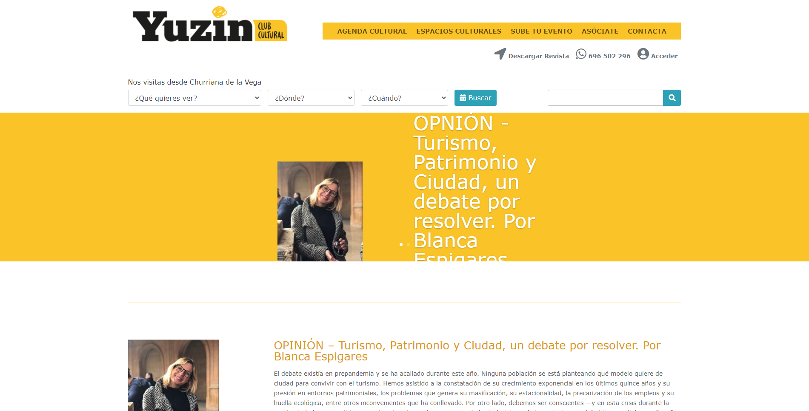

### Metodología a usar

Dado que se parte de un diseño ya existente, primero se va a realizar un Usability Report del diseño actual para plantear posibles mejoras sin empezar desde cero, y después, por pasos, se hará un rediseño desde 0. El rediseño se propone como app móvil, ya que —como se verá en el usability report— aunque el diseño actual sea mejorable, estimo más interesante proponer un diseño totalmente distinto orientado a los usuarios móviles.

### Paso 1: Usability Report

En este paso se va a plantear un pequeño informe con algunos problemas que se han detectado en el diseño actual y sus posibles soluciones.

- El **tiempo de respuesta** del servidor es de entre 1.2s y 1.8s en las pruebas que se han realizado:

  | 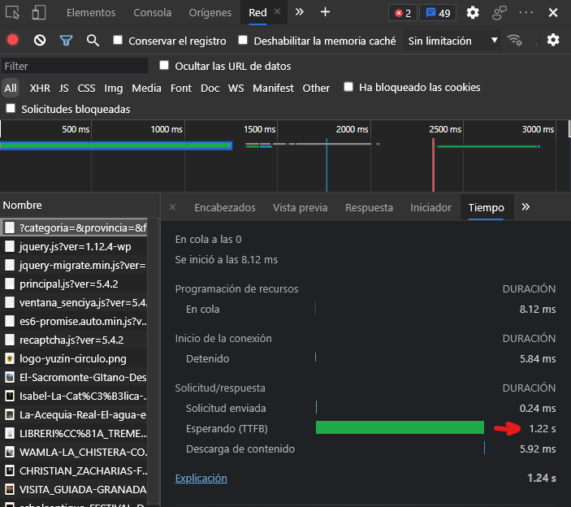 | 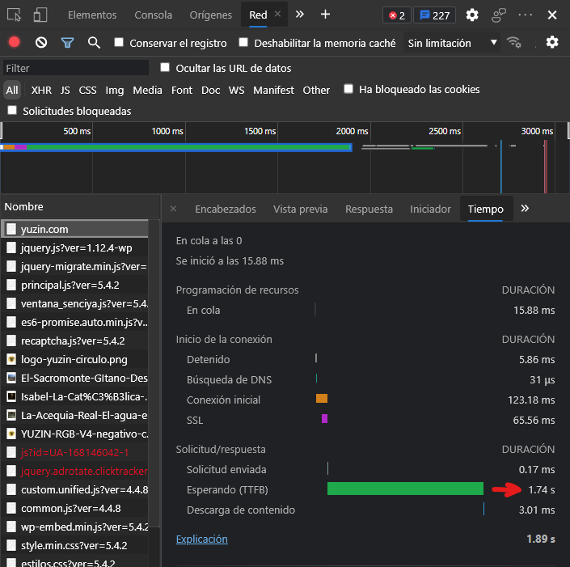 | 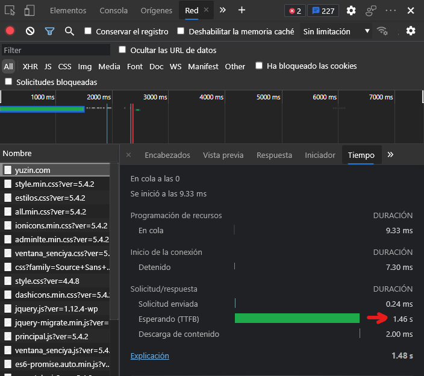 |
  | ------------------------------------------------------ | ------------------------------------------------------ | ------------------------------------------------------ |

  Siempre **superan 1s**, límite después del cual las personas perdemos el hilo de pensamiento ([**Jakob Nielsen - Response Time Limits**](https://www.nngroup.com/articles/response-times-3-important-limits/)). Por tanto, mientras navegamos por esta web es normal que las esperas nos hagan perder el flujo, aumentando la posibilidad de que el usuario salga de la plataforma.

  La plataforma debería revisar la configuración de su servidor, incluyendo la lógica de back-end o la ubicación del hosting, para solucionar este problema.

- Tal y como se puede ver en la [imagen de arriba](#estado-actual), los *slides* de la página principal manifiestan algunos problemas. Uno de ellos es que el **texto** a veces **no cabe** en el ancho que tiene especificado, por lo que se sale del contenedor hacia abajo. Esto tiene una fácil solución: en el CSS, el selector `.et_pb_fullwidth_slider_0 .et_pb_slide>.et_pb_container` debería incluir el atributo `width: 100%`, y no `width: 45%`:

  |                 Cambio CSS                 |                        Nuevo aspecto                         |
  | :----------------------------------------: | :----------------------------------------------------------: |
  | 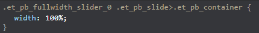 | 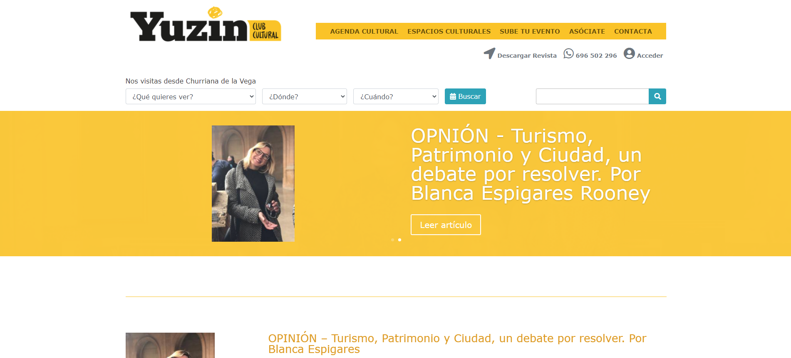 |

  

- El **contraste** entre el texto de los *slides* y el color o imagen de fondo no cumple los estándares de accesibilidad:

  

  Podemos ver que su *contrast ratio* es 1.61, y el mínimo para cumplir el estándar WCAG AA es de [3 para texto grande](https://webaim.org/resources/contrastchecker/). Una solución posible sería darle más sombra al texto, o directamente hacer que este texto sea negro. En la imagen del siguiente apartado se muestra la primera solución.

- El **botón principal** de los slides **no está resaltado**. Por el [Efecto Von Restorff](https://lawsofux.com/von-restorff-effect/), sabemos que las acciones clave deben ser distinguidas visualmente. Una solución posible para resaltar este botón sería darle un color de fondo uniforme y más peso al texto interior.

  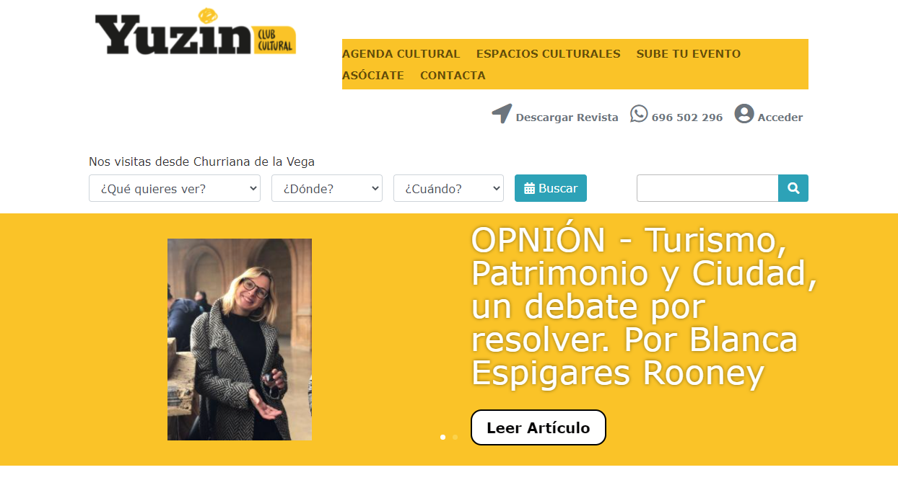

  

- Existe muy poca **diferenciación** o contraste entre la **barra superior** y el contenido de la web. La mejora propuesta consiste en hacer que el color de fondo de toda la barra superior sea uniforme, de forma que esta quede **resaltada**:

  

  Hemos cumplido la [Ley de Jakob](https://lawsofux.com/jakobs-law/): solo con este pequeño cambio, la página ya resulta más coherente con el resto de páginas que solemos visitar, que suelen resaltar la barra superior. Además hemos conseguido que el usuario perciba el encabezado como un **único grupo**: [Law of Common Region](https://lawsofux.com/law-of-common-region/).

- Sería también conveniente que al menos la parte principal de la **barra superior** (opciones) se quede **fija** en la pantalla aunque hagamos *scroll*. De este modo, el usuario puede acceder a los demás apartados principales de la página sin hacer scroll hasta el principio, teniendo en cuenta la [Ley de Fitt](https://lawsofux.com/fittss-law/) y siendo una de las tareas principales del usuario el moverse entre secciones:

  > La distancia entre el área de atención del usuario y el botón para realizar la tarea debe ser lo más corta posible

- El **número de teléfono** que aparece en la parte superior de la página está en forma de enlace y con el icono de WhatsApp, lo cual podría llevar al usuario a la equívoca conclusión de que este enlace le permitirá enviar un mensaje WhatsApp a la plataforma. Sin embargo, este enlace **no hace nada** (su atributo `href` es `href="#"`). Su solución es tan fácil como utilizar la API de WhatsApp enlazando a [`https://wa.me/34696502296`](https://wa.me/34696502296).

  Tal y como se ha visto en la asignatura, las **metáforas** que usemos en nuestro diseño llevan al usuario a conclusiones. Si usamos un enlace con icono de WhatsApp, el elemento debe ser un enlace para contactar mediante WhatsApp.

- En **dispositivos móviles** o con pantalla pequeña el diseño básicamente no funciona. Los elementos se desordenan y ni siquiera aparece el menú principal. La solución a esto sí que sería un rediseño total teniendo en cuenta las pautas de diseño *responsive*.

  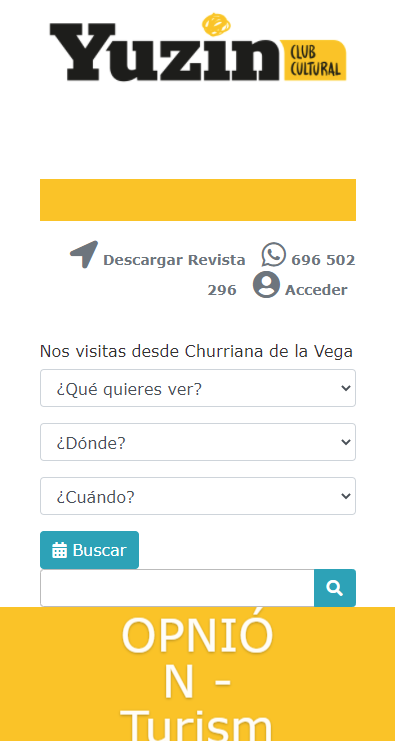

### Paso 2: UX Design

Se va a realizar el diseño de un 

#### 2.a ScopeCanvas

#### 2.b Wireframes

### Paso 3: Mi UX-Case Study (diseño)

#### 3.a Moodboard

#### 3.b Guidelines

#### 3.c Mockup

### Conclusiones

